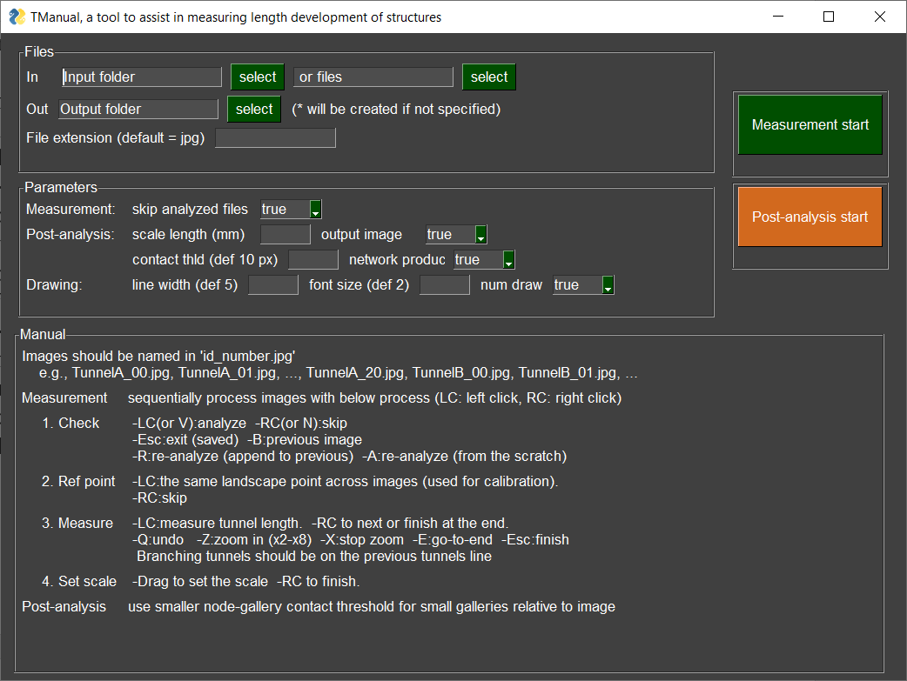

# TManual: Assistance for manually measuring length development of animal structures
<div align="center">

</div>

**TManual** is a python program that assists in manual measurements of length development (preprint will be available soon [Mizumoto 2022](https://doi.org/XXXXXXXXXX)). It can be used to measure the length of objects and extract network structures from sequential images, such as snapshots, time-laps, and video clips. It is designed especially for gallery structures built by animals but can be applied to any other objects. 

## How TManual works?
* Measure the length of the object by just clicking on images.
* Inferring the branching structure and reconstruct network.
* Taking over all data-handling processes (scaling, zero-adjustment, measurement, branch structures, creating tidy dataframe), so that users can only focus on clicking without interruptions.
* Appending data for sequential images to easily trace time-development.
* **Realize stress-free and efficient manual measurement of a large number of images.**

## How to get TManual
TManual can be installed as 1) a Python package, 2) an [EXE file](standalone/tmanual_standalone.exe) for Windows users, or 3) a standalone [python file](tandalone/tmanual_standalone.py).

### 1. Python package
```
pip install git+https://github.com/nobuaki-mzmt/tmanual
```
As all requirements will be installed together, I recommend using a virtual environment (e.g., [Anaconda](https://www.anaconda.com/)).  
Then run the following in python.
```python
import tmanual
tmanual.gui()
```

### 2. EXE file
Download [here](standalone/tmanual_standalone.exe).  
It is a bit heavy, but you can start TManual with just one click.

### 3. Standalone python file
Download [here](standalone/tmanual_standalone.py).  
As in the package, you will need to prepare the requirements listed [here](requirements.txt).

## How to use TManual
There is a Manual on a GUI interface.  
Please see the detail for the preprint [(Mizumoto 2022)](https://doi.org/XXXXXXXXXX). 

<div align="center">

</div>

* Measurement
In measurement program, TManual shows all images sequentially and gets user input to create res.picke. Measurement consists of the following process:
1. Check  
Users decide the action for the desplayed image
2. Ref point  
Indicate the reference point. The reference point is an identifiable landmark across all images (e.g., the corner of the experimental arena). This is useful when the relative position of the camera and object is not fixed (e.g., when users take photos every 24 hours and need to bring the experimental arena under the camera when filming). If the camera and object are fixed, users can skip the process (The Ref point will be a left-above corner of the image).
3. Measure  
Users draw the galleries as freeform line objects with straight segments. Branching galleries should be contact with previous galleries.
4. Scale  
Measure the length of the scale object. This is used to convert the unit from pixel to mm during the post-analysis.

* Post-analysis


## Contributor
Nobuaki Mizumoto, Okinawa Institute of Science and Technology  
Contact: nobuaki.mzmt at gmail.com
